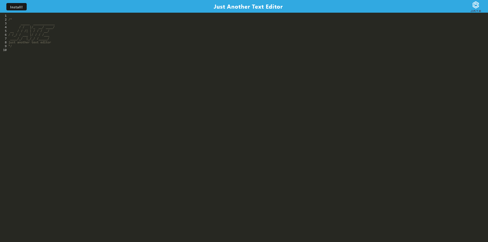

# Offline Text Editor
[](https://opensource.org/licenses/MIT)

## Description

The purpose of this application is to create a text editor that can be open in any browser with the deployment link and that can be used offline without internet connection. When the user opens the webpage he will be presented with the text editor where he will be able to start working on a new project with javascript. Once he is finished with his project or wants to test he will be able to install with the install button and he will be able to access the project through a file on his desktop. He will then be able to deploy and use his newly generated website or application.

Link to deployed application: https://text-editor-2158.herokuapp.com/

Link to GitHub repository: https://github.com/AndreV96/Noted

Screenshot of deployed webpage: 



## Table of Contents 

- [Installation](#installation)

- [Usage](#usage)

- [License](#license)

- [Contributing](#contributing)

- [Questions](#questions)

## Installation

To install necessary dependencies, follow the next steps and run these commands:

```bash
npm i
```

## Usage

This text editor can be used whenever you are offline, when you don't have access to an internet service provider and need to work on any project, algorithm or just practice your coding abilities.

## License

This project is licensed under the MIT license

## Contributing

Sole contributor: AndreV96

## Questions

If you have any questions about the repository, open an issue or contact me directly at ventaslederer@hotmail.com . You can find more of my work at [https://github.com/AndreV96](https://github.com/AndreV96/).

